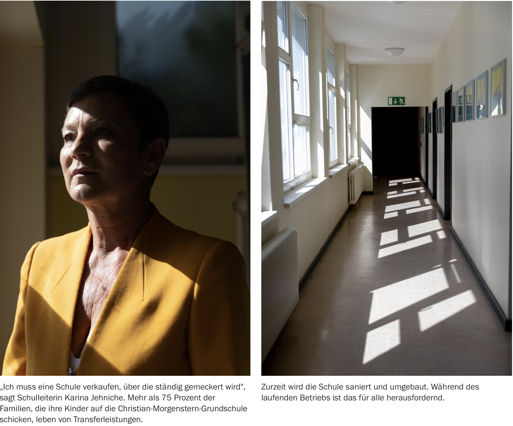

# hi there 🌸

My name is Moritz Valentino Matzner. I am a (data) journalist based in Berlin.

I am interested in the political economy of data and in foreign policy. My work focuses on stories that investigate the structural sources of inequality and broaden our imagination of what is politically feasible. Methodologically, I combine quantitative analysis with reporting, using data to contextualize and interrogate anecdotal evidence.
 

As part of the Tagesspiegel Innovation Lab, my work has been recognized with the <a href="https://www.grimme-online-award.de/archiv/2024/preistraeger/preistraeger-detail/d/europaeische-waffen-amerikanische-opfer-1">Grimme Online Award</a> and the <a href="https://www.tagesspiegel.de/berlin/schule/interaktive-serie-uber-lehrermangel-in-berlin-tagesspiegel-gewinnt-deutschen-lokaljournalistenpreis-der-adenauer-stiftung-12644579.html">German Award for Local Reporting</a>. An investigation I co-researched was named one of the <a href="https://gijn.org/stories/2023-best-investigative-stories-german/">best investigative stories in German</a> in 2023 by the Global Investigative Journalism Network (GIJN). In March 2026, I will complete my two-year editorial traineeship at the German daily <a href="http://tagesspiegel.de/autoren/moritz-valentino-matzner">Der Tagesspiegel</a>.
 

Before turning to journalism, I worked as a research associate at Freie Universität Berlin and taught a course on <a href="https://moritzvalentinomatzner.shinyapps.io/kdst/">Critical Data Science</a>. I hold a Master’s degree in Political Science from Freie Universität Berlin and an MA in International Security from Sciences Po Paris. I also studied at the University of Chicago.
 

If you are interested in my work, you can contact me via email by clicking <a href="mailto:moritzvalentinomatzner@posteo.net">here</a>. You can also reach me via encrypted Signal message by clicking on <a href="https://signal.me/#eu/WlK3PXx3vXFN0SJ8kiJfcfyQThRoLVemldrSk650jfXpvc5yC-VMmbWvttsWYl33">this link</a>. My username is mvm.404. 
 

You can also find me on <a href="http://instagram.com/moritzvalentino_/">Instagram</a> and <a href="http://linkedin.com/in/moritzvalentino/">LinkedIn</a>. 

# some projects I am proud of 🦋

--- 
An der Grenze des Rechts. Der Tagesspiegel. August 2025. Verstößt die EU in ihrem Kampf gegen Migration im zentralen Mittelmeer gegen internationales Recht? Nein, sagen internationale Gerichte. Denn weder die EU-Kommission noch und ihre Grenzschützer von Frontex wurden jemals verurteilt. Ist also alles ok, im zentralen Mittelmeer? Um das herauszufinden, bin ich mit einem Flugzeug an die Grenze Libyens geflogen und habe die libysche Küstenwache und Frontex bei ihrer Arbeit beobachtet. Ein Reportage über die Externalisierung der EU-Außengrenzen als rechtliche Strategie, um sich <a href="https://www.tagesspiegel.de/internationales/macht-sich-die-eu-im-mittelmeer-strafbar-mit-dem-flugzeug-an-die-grenze-des-rechts-14058410.html">Gerichten zu entziehen</a>. 
 

 
english version 

 
 

Investigating Frontex legal responsibility in the Mediterranean. I traveled to Lampedusa and deployed by air to international waters off Libya to investigate how Libyan and European actors enforce the EU's external border in the central mediterranean. My narrative piece focussed on the externalization of borders as a legal strategy and integrated a visual investigation including on-site video interviews. <a href="https://www.tagesspiegel.de/internationales/macht-sich-die-eu-im-mittelmeer-strafbar-mit-dem-flugzeug-an-die-grenze-des-rechts-14058410.html"> Longread in German</a>.  
 

--- 

Tod aus Europa. Der Tagesspiegel / ZDF Magazin Royale. Sommer 2023. Mehr als 40.000 Menschen sterben in den Vereinigten Staaten jedes Jahr durch Schusswaffen – eine Tragödie, die für europäische Waffenkonzerne einen Milliardenmarkt bietet. Ein Team von Tagesspiegel und ZDF Magazin Royale hat Dokumente ausgewertet, Daten erhoben, Experten und Insider befragt und Überlebende von US-Massakern interviewt. Entstanden ist ein umfangreiches Dossier, das sich in acht Kapiteln dem US-Waffenkult und seinen europäischen Profiteuren widmet, eingeleitet durch eine visuell ansprechende grafische Aufbereitung der recherchierten Daten. Ausgezeichnet mit dem <a href="https://www.grimme-online-award.de/archiv/2024/preistraeger/preistraeger-detail/d/europaeische-waffen-amerikanische-opfer-1">Grimme Award Online</a>, Kategorie Information. Link zur <a href="https://interaktiv.tagesspiegel.de/waffen/europaeische-waffen-amerikanische-opfer/">Recherche</a>. 
 

 
english version 

 
 

European Weapons in the US. More than 40,000 people die each year in the United States as a result of gun violence — a tragedy that represents a multibillion-dollar market for European arms manufacturers. A joint team from Der Tagesspiegel and ZDF Magazin Royale analyzed documents, collected data, interviewed experts and insiders, and spoke with survivors of mass shootings in the US. The result is an extensive dossier that explores the US gun culture and its European profiteers across eight chapters, introduced by a visually compelling, data-driven presentation of the investigation’s findings. Awarded the <a href="https://www.grimme-online-award.de/archiv/2024/preistraeger/preistraeger-detail/d/europaeische-waffen-amerikanische-opfer-1">Grimme Online Award</a> in the Information category. Link to the <a href="https://interaktiv.tagesspiegel.de/waffen/europaeische-waffen-amerikanische-opfer/">investigation</a>.
 

--- 

Berliner Bildungskrise: Die Klassenfrage. Der Tagesspiegel, August 2023 bis Frühjahr 2025. Drei Viertel aller öffentlichen Schulen in Berlin hatten im Schuljahr 2022/23 zu wenig Lehrkräfte. Sind alle Schüler\*innen gleich betroffen? Oder verschärft die Bildungskrise bestehende Ungleichheiten? Ich habe Daten zum Personalmangel auf Schulebene gesammelt und gezeigt, wie der Wohnort die Schulqualität beeinflusst. Denn wer im falschen Bezirk zur Schule mus, hat schlechtere Chancen auf eine vernünftige Ausbildung. Die Umsetzung war eine Datenanalyse mit [interaktiver Karte](https://interaktiv.tagesspiegel.de/lab/berliner-klassenfrage-hier-gibt-es-am-meisten-unterrichtsausfall-datenanalyse-und-interakive-karte/) und ein [Longread](https://interaktiv.tagesspiegel.de/lab/ohne-reserve-eine-berliner-schulleiterin-kaempft-mit-dem-lehrermangel/). Paywall. Ich habe die Recherche auf der <a href="https://www.toepfer-stiftung.de/de/wie-wir-wirken/rueckblick/bildungswerkstatt-mit-correctiv-lokal">Bildungswerkstatt für Lokaljournalist*innen</a> der Toepfer Stiftung und Correctiv.Lokal im Berliner Publix vorgestellt.
 

 
english version 

 
 

Berlin's educational crisis. Nearly three quarters of Berlin’s public schools are affected by teacher shortages. I collected and analyzed school-level data on teachers and students and demonstrated how attending school in certain districts reduces students’ chances of receiving an adequate education. The project combined data analysis with editorial storytelling, resulting in an <a href="https://interaktiv.tagesspiegel.de/lab/berliner-klassenfrage-hier-gibt-es-am-meisten-unterrichtsausfall-datenanalyse-und-interakive-karte/">Interactive map</a> and an in-depth <a href="https://interaktiv.tagesspiegel.de/lab/ohne-reserve-eine-berliner-schulleiterin-kaempft-mit-dem-lehrermangel/">longread</a>. In German.
 
 

--- 

Kitanotstand: Wie das System versagt. CORRECTIV.Lokal. November 2023. Die deutschen Kitas stehen vor dem Zusammenbruch: Erzieherinnen vor dem Burnout, Schließungen durch Personalmangel – und Kinder, die nur verwahrt statt gefördert werden. Tausende Kita-Mitarbeitende berichten von ihren Erfahrungen. Mit einer Onlineplattform wurden tausende Kita-Mitarbeitende und Eltern befragt, welche Folgen der Personalmangel in Kitas für sie hat. Für diesen Artikel wurden alle 2.005 Antworten von Kita-Mitarbeitenden ausgewertet. Link zur [Recherche](https://correctiv.org/aktuelles/bildung/2023/11/14/kitanotstand-wie-das-system-versagt-personalmangel-erzieher/) und [Themenseite](https://correctiv.org/aktuelles/bildung/2023/11/10/kitanotstand-was-sie-tun-koennen/). Teil des Rechercheteams. No Paywall.
 

 
english version 

 
 

Kita Notstand. Not only public schools, but also the German pre-school system is in crisis. According to a recent study, more than 380.000 spots are missing and the system is short of roughly 100.000 educators. We surveyed more than 6.800 teachers and parents. They paint a dire picture of a collapsing system. <a href="https://correctiv.org/aktuelles/bildung/2023/11/14/kitanotstand-wie-das-system-versagt-personalmangel-erzieher/">Longread</a> and <a href="https://correctiv.org/aktuelles/bildung/2023/11/10/kitanotstand-was-sie-tun-koennen/"> project site</a>. In German. 
 

--- 

Demo Atlas. Der Tagesspiegel. Oktober 2023. Ob Aufmarsch Hunderttausender oder Ein-Mann-Kundgebung: Im Schnitt gibt es täglich 16 Demos in Berlin. Wer demonstriert in Ihrer Nachbarschaft – und wofür? Die Transparenz-Initiative „FragDenStaat“ hat Daten zu Demonstrationen per Informationsfreiheitsanfrage von der Berliner Polizei erhalten. Das Tagesspiegel Innovation Lab hat sie ausgewertet und Berlins Protestlandschaft kartografiert. Link zur [Karte](https://interaktiv.tagesspiegel.de/lab/demo-atlas-berlin-wofuer-wird-in-meiner-nachbarschaft-demonstriert/) und [Analyse](https://interaktiv.tagesspiegel.de/lab/demo-analyse-berlin-wofuer-gehen-die-leute-auf-die-strasse/). Datenverarbeitung und -analyse. Keine Paywall.
 

 
english version 

 
  

 Demo Atlas. Der Tagesspiegel, October 2023.
Whether a march of hundreds of thousands or a one-person protest, on average there are 16 demonstrations per day in Berlin. Who is protesting in your neighborhood and what for?
The transparency initiative FragDenStaat obtained demonstration data from the Berlin police through freedom of information requests. The Tagesspiegel Innovation Lab analyzed the data and mapped Berlin’s protest landscape.
Links to the <a href="https://interaktiv.tagesspiegel.de/lab/demo-atlas-berlin-wofuer-wird-in-meiner-nachbarschaft-demonstriert/">interactive map</a> and the <a href="https://interaktiv.tagesspiegel.de/lab/demo-analyse-berlin-wofuer-gehen-die-leute-auf-die-strasse/">analysis</a>. Data processing and analysis. No paywall.

---

Neukölln Komplex. Dokumentarfilm. Als Neukölln-Komplex wird eine rechte Gewaltserie in Berlin-Neukölln bezeichnet. Dazu zählen seit 2011 über 70 Straftaten, 23 Brandstiftungen und mindestens zwei Morde auf offener Straße. Für viele Betroffene ist klar: Ein rechtes Netzwerk mit Verbindungen in Polizei und Justiz verhindert die Auflärung. Seit 2022 befasst sich mit mit dem Komplex ein parlamentarischer Untersuchungsausschuss im Berliner Abgeordnetenhaus. Der Dokumentarfilm entsteht seit Sommer 2021 als Teil einer Langzeitdokumentation. Co-Regie.

 
english version 

 

Neukölln Complex. For years, a series of far-right attacks rocked Berlin’s Neukölln district. The attacks include more than 70 criminal offenses, including 23 arson attacks and at least two murders carried out in public spaces. For many of those affected, it is clear that a far-right network—with alleged connections to police and judicial authorities—has obstructed a full investigation. Since 2022, the case has been examined by a parliamentary inquiry committee in the Berlin House of Representatives. The film has been in production since summer 2021 as part of a long-term documentary project.  
 

---

Ich habe außerdem darüber geschrieben wie die EU versucht, ihre [Außengrenzen auf den afrikanischen Kontinent zu verschieben](https://www.sueddeutsche.de/politik/migrationspolitik-wie-europa-fluechtlinge-in-afrika-aufhalten-will-1.3314104); 
ein [US-Bundesstaaten Abschiebungen verhindern wollte](https://www.sueddeutsche.de/politik/usa-wir-werden-kein-zahnrad-in-trumps-abschiebemaschine-sein-1.3351675) und wie [Donald Trump das versuchte zu untergraben](https://www.sueddeutsche.de/politik/abschiebungen-in-den-usa-trumps-angriff-auf-elf-millionen-1.3379310); warum [Afghanistan kein sicheres Herkunftsland ist](https://www.sueddeutsche.de/politik/abschiebung-nach-afghanistan-afghanistan-ist-zweifelsfrei-kein-sicheres-herkunftsland-1.3296536); wieso Matteo Renzi in Italien [mit seiner Verfassungsreform gescheitert ist](https://www.sueddeutsche.de/politik/italien-wieso-renzi-mit-seiner-verfassungsreform-gescheitert-ist-1.3280174), was die [Cinque Stelle möchten](https://www.sueddeutsche.de/politik/europaeisches-parlament-fuenf-sterne-und-die-liberalen-eine-absurde-allianz-1.3325639) und wie ein italienisches Geschwisterpaar [Politik und Wirschaft ausgespäht haben](https://www.sueddeutsche.de/politik/italien-spionagezentrale-in-rom-ausgehoben-1.3327575); über die Versuche, in Deutschland ein [öffentlichen Lobbyregister zu schaffen](https://www.sueddeutsche.de/politik/oeffentliches-lobbyregister-lobbyismus-muss-ueberwacht-werden-koennen-1.3360659); wie Russland und die USA [Wahlen beeinflussen](https://www.sueddeutsche.de/politik/wahlforscher-das-sollte-nicht-verharmlost-werden-1.3390497); warum Menschen in Rümänien [gegen Sorin Grindeanus demonstrieren](https://www.sueddeutsche.de/politik/proteste-gegen-regierung-warum-die-rumaenen-in-aufruhr-sind-1.3366611). 

 

---

# lehre
In the winter semester of 2022/23, I worked as a research associate at Freie Universität Berlin, at the Otto Suhr Institute for Political Science, Chair of International Political Economy. I taught a course on <a href="https://moritzvalentinomatzner.shinyapps.io/kdst/">Critical Data Science</a>.

 
kursinfo 

 
 

Wie kann quantitative Datenarbeit für emanzipatorische Wissenschaft genutzt werden? Unter welchen Bedingungen ist eine kritische Auseinandersetzung mit Daten und quantitativen Methoden möglich?
 

Der Kurs Kritische Data Science vermittelt Grundkenntnisse des Programmierens sowie des Sammelns, Visualisierens und Analysierens von Daten in der Skriptsprache R. Zugleich thematisiert er die politische Geschichte quantitativer Methoden: Datenarbeit ist eng mit Macht, Diskriminierung und Herrschaft verwoben und wurde historisch vor allem als Instrument der Mächtigen eingesetzt.
 

Aus einer intersektionalen, machtkritischen Perspektive untersucht der Kurs, welche sozialen Beziehungen und politischen Annahmen in Daten eingeschrieben sind, wer Daten über wen produziert – und wie Daten aus einer emanzipatorischen Perspektive genutzt werden können. Neben akademischer Literatur werden auch journalistische, künstlerische und aktivistische Projekte einbezogen.

 

 
english version 

 
 
How can quantitative data work be used for emancipatory scholarship? What conditions are necessary for a critical engagement with data and quantitative methods?

 

This course is divided into two parts. In the first, students acquire basic programming skills in R and learn the collection, visualization, and analysis of data using the programming language R.
 

The second part focuses on the political economy of data. It examines how data practices are historically and politically entangled with power, inequality, and exclusion, and how quantitative methods have been used to govern, classify, and control. Through an intersectional, power-critical lens, the course asks whose perspectives are inscribed in data, who produces data about whom, and how data can be mobilized for emancipatory purposes. Alongside academic literature, the course engages with examples from journalism, activism, and the arts.
 

